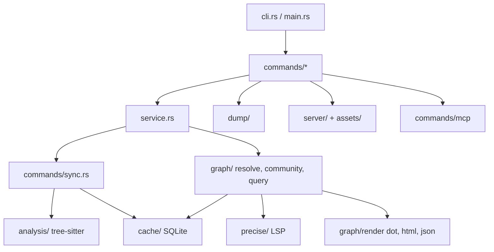

<!-- generated-by: gsd-doc-writer -->
# Architecture

## System overview

`codebase-recall` (binary `code-rcl`) is a single-binary Rust CLI that analyzes a source tree and produces token-efficient context for LLMs and developers: codebase digests, impact (blast radius) reports, relation-aware context dumps, and dependency graphs. Source files are parsed with tree-sitter, stored incrementally in a per-project SQLite cache, resolved into a code graph, and rendered as markdown, JSON, DOT, or an interactive HTML viewer. The architecture is a layered, cache-then-graph pipeline; it also exposes its tools over an MCP JSON-RPC stdio server.

## Component diagram



## Data flow

1. `src/main.rs` normalizes `help` arguments, parses `Cli` (clap), and dispatches to `commands::<cmd>::run`.
2. Read-only commands call `service::auto_sync`, which runs `commands::sync::sync_cache`: it walks files (`ignore` crate), hashes content with blake3, parses only changed files via `analysis`, and writes results to the cache.
3. `graph::resolve` reads the cache and resolves references (imports, scope, types, optional precise LSP data) into edges, producing a `CodeGraph`.
4. The command renders the result: markdown digest, impact tree, path/explain output, graph (dot/html/json), or dump bundle.

`serve` builds the graph, then `server/mod.rs` serves embedded assets on 127.0.0.1 using `tiny_http`; a `/live` event stream keeps the server alive and it exits when the browser tab closes, on `/quit`, or on Ctrl-C.

Persistent state lives only in `<project>/.code-rcl/cache.db` (plus a generated `REPORT.md`).

## Key abstractions

| Abstraction | Location | Description |
|-------------|----------|-------------|
| `ParsedFile` | `src/analysis/mod.rs` | Per-file symbols, imports, refs, scopes, bindings, string literals |
| `Language` | `src/analysis/lang.rs` | Supported language detection |
| `CodeGraph` / `Node` / `Edge` | `src/graph/mod.rs` | Resolved dependency graph with communities |
| `GraphQuery`, `SyncArgs`, `PreciseArgs` | `src/cli.rs` | Shared CLI argument groups |
| `CacheDb` | `src/cache/mod.rs` | SQLite access; schema and forward-only migrations in `src/cache/schema.rs` (`SCHEMA_VERSION`) |
| service helpers | `src/service.rs` | Shared auto-sync and `GraphQuery` builders; use these rather than rebuilding setup in each command |

Languages analyzed: Rust, Python (including notebooks), JavaScript/TypeScript (including single-file components), Java, Kotlin, Go, and TOML config keys.

## Directory structure rationale

```text
src/
  main.rs, cli.rs   entry point and clap definitions
  commands/         one module per subcommand (sync, digest, impact, graph, serve, dump, mcp, setup, ...)
  service.rs        shared sync and graph-query helpers
  analysis/         tree-sitter extraction, one module per language
  cache/            SQLite schema, queries, mutations, models
  graph/            resolve -> CodeGraph, community detection, query, render
  precise/          optional LSP clients (rust-analyzer, Pyright, JDT, kotlin-ls)
  dump/             context bundle walker and formatter
  server/           local graph viewer HTTP server
  assets/           embedded web UI (d3, graph JS/CSS, icons)
tests/              CLI integration tests and language fixtures
scripts/            codebase-recall installers
skills/             code-rcl agent skill
```

## Constraints

- Mostly synchronous; `serve` uses threads and atomics.
- Edges are heuristic from the AST; `--precise` LSP data overrides them when available, and missing language servers are skipped with install hints.
- Errors propagate as `anyhow::Result` to `main`.
