# Grand Plan: Sistem Plugin Bahasa Dinamis untuk `codebase-recall`

> Panduan implementasi lengkap untuk menambahkan dukungan bahasa **Go, C, C++, Java, dan Kotlin** melalui arsitektur plugin yang dapat diperluas. Ditulis untuk junior engineer yang membutuhkan bimbingan langkah demi langkah.

---

## Daftar Isi

1. [Konteks & Motivasi](#1-konteks--motivasi)
2. [Peta Arsitektur Saat Ini](#2-peta-arsitektur-saat-ini)
3. [Kamus Istilah Teknis](#3-kamus-istilah-teknis)
4. [Arsitektur Target](#4-arsitektur-target)
5. [Milestone & Urutan Pengerjaan](#5-milestone--urutan-pengerjaan)
6. [Milestone 1 — Refactor: Trait Analyzer & LanguageRegistry](#6-milestone-1--refactor-trait-analyzer--languageregistry)
7. [Milestone 2 — Generic Tree-Sitter Analyzer](#7-milestone-2--generic-tree-sitter-analyzer)
8. [Milestone 3 — Dynamic Plugin Loader (libloading)](#8-milestone-3--dynamic-plugin-loader-libloading)
9. [Milestone 4 — Plugin Manifest & Discovery](#9-milestone-4--plugin-manifest--discovery)
10. [Milestone 5 — Import Resolver per Bahasa](#10-milestone-5--import-resolver-per-bahasa)
11. [Milestone 6 — CLI Plugin Management](#11-milestone-6--cli-plugin-management)
12. [Milestone 7 — Distribusi Grammar Pre-Built](#12-milestone-7--distribusi-grammar-pre-built)
13. [Strategi Pengujian](#13-strategi-pengujian)
14. [Risiko & Mitigasi](#14-risiko--mitigasi)
15. [Checklist Final](#15-checklist-final)

---

## 1. Konteks & Motivasi

### Apa yang sudah kita punya?

Aplikasi `code-rcl` saat ini bisa menganalisis kode sumber untuk menghasilkan *dependency graph* (peta hubungan antar file, fungsi, dan modul). Bahasa yang sudah didukung:

| Bahasa | File Parser | Cara Kerja |
|--------|------------|------------|
| Rust | [rust.rs](file:///c:/Users/SHI-CHAN/Documents/Projects/code-reviewer/src/analysis/rust.rs) | Tree-sitter grammar di-compile langsung ke binary |
| JavaScript/JSX | [javascript.rs](file:///c:/Users/SHI-CHAN/Documents/Projects/code-reviewer/src/analysis/javascript.rs) | Tree-sitter grammar di-compile langsung ke binary |
| TypeScript/TSX | (sama dengan JS) | Tree-sitter grammar di-compile langsung ke binary |
| Python | [python.rs](file:///c:/Users/SHI-CHAN/Documents/Projects/code-reviewer/src/analysis/python.rs) | Tree-sitter grammar di-compile langsung ke binary |
| Vue (.vue) | [sfc.rs](file:///c:/Users/SHI-CHAN/Documents/Projects/code-reviewer/src/analysis/sfc.rs) | Ekstrak `<script>` lalu delegasikan ke parser TS/JS |
| Svelte (.svelte) | (sama dengan Vue) | Ekstrak `<script>` lalu delegasikan ke parser TS/JS |

### Mengapa tidak bisa terus menambah grammar ke binary?

Lihat file [Cargo.toml](file:///c:/Users/SHI-CHAN/Documents/Projects/code-reviewer/Cargo.toml) baris 21-25:

```toml
tree-sitter = "0.25"
tree-sitter-rust = "0.24"
tree-sitter-javascript = "0.23"
tree-sitter-typescript = "0.23"
tree-sitter-python = "0.23"
```

Setiap crate `tree-sitter-*` berisi kode C yang di-compile dan **disolder permanen** ke dalam file `.exe`. Jika kita menambahkan 5 bahasa lagi:

```
tree-sitter-go        → +2 MB
tree-sitter-c         → +1 MB
tree-sitter-cpp       → +4 MB  (grammar C++ sangat besar!)
tree-sitter-java      → +2 MB
tree-sitter-kotlin    → +2 MB
```

**Dampak negatifnya:**
1. **Ukuran binary membengkak**: dari ~15 MB menjadi ~26 MB+
2. **Waktu kompilasi meledak**: grammar C++ saja butuh 30+ detik compile
3. **Pengguna tidak bisa memilih**: semua bahasa ikut terbawa meskipun tidak dibutuhkan
4. **Menambah bahasa baru = harus rilis versi baru**: tidak fleksibel

---

## 2. Peta Arsitektur Saat Ini

Sebelum mengubah apapun, kita harus paham betul bagaimana kode berjalan saat ini. Berikut adalah alur data dari ujung ke ujung:

```
┌──────────────────────────────────────────────────────────────────────┐
│                        ALUR DATA SAAT INI                            │
│                                                                      │
│   code-rcl sync                                                      │
│       │                                                              │
│       ▼                                                              │
│   walker.rs ──► Scan semua file di disk                              │
│       │                                                              │
│       ▼                                                              │
│   lang.rs ──► Language::from_path("main.rs") → Language::Rust        │
│       │        Language::from_path("app.py") → Language::Python      │
│       │        Language::from_path("app.go") → None ← DITOLAK!       │
│       ▼                                                              │
│   mod.rs ──► parse_file(Language::Rust, source)                      │
│       │        → match language { Rust => rust::parse(source) }      │
│       ▼                                                              │
│   rust.rs ──► tree_sitter_rust::LANGUAGE                             │
│       │        Parser::new() → parse(source) → AST Tree              │
│       │        Walker: walk AST → extract symbols, imports, refs     │
│       ▼                                                              │
│   ParsedFile { symbols, imports, refs, parse_ok }                    │
│       │                                                              │
│       ▼                                                              │
│   cache/mod.rs ──► replace_file_analysis() → simpan ke SQLite        │
│       │                                                              │
│       ▼                                                              │
│   graph/resolve/ ──► resolve_import(), resolve_ref()                 │
│       │                → bangun Node dan Edge untuk grafik           │
│       ▼                                                              │
│   graph/render/ ──► HTML / JSON / DOT                                │
└──────────────────────────────────────────────────────────────────────┘
```

### File-file kunci yang perlu kamu pahami

| File | Tanggung Jawab | Perlu Diubah? |
|------|---------------|---------------|
| [lang.rs](file:///c:/Users/SHI-CHAN/Documents/Projects/code-reviewer/src/analysis/lang.rs) | Enum `Language` — daftar semua bahasa yang dikenali | ✅ Ya, sangat banyak |
| [mod.rs](file:///c:/Users/SHI-CHAN/Documents/Projects/code-reviewer/src/analysis/mod.rs) | Fungsi `parse_file()` — dispatcher ke parser yang tepat | ✅ Ya, ganti dengan registry |
| [rust.rs](file:///c:/Users/SHI-CHAN/Documents/Projects/code-reviewer/src/analysis/rust.rs) | Parser Rust — contoh parser manual yang sudah ada | ❌ Tidak diubah |
| [sync.rs](file:///c:/Users/SHI-CHAN/Documents/Projects/code-reviewer/src/commands/sync.rs) | Perintah `sync` — memanggil `parse_file()` | ✅ Ya, perlu inisialisasi registry |
| [imports.rs](file:///c:/Users/SHI-CHAN/Documents/Projects/code-reviewer/src/graph/resolve/imports.rs) | Resolusi path import per bahasa | ✅ Ya, tambah resolver baru |
| [refs.rs](file:///c:/Users/SHI-CHAN/Documents/Projects/code-reviewer/src/graph/resolve/refs.rs) | Mencocokkan pemanggilan fungsi ke definisinya | ✅ Ya, sedikit |
| [models.rs](file:///c:/Users/SHI-CHAN/Documents/Projects/code-reviewer/src/cache/models.rs) | Struct data: `NewSymbol`, `NewImport`, `NewRef` | ❌ Tidak diubah |
| [Cargo.toml](file:///c:/Users/SHI-CHAN/Documents/Projects/code-reviewer/Cargo.toml) | Daftar dependency | ✅ Ya, tambah `libloading` + `dirs` |

---

## 3. Kamus Istilah Teknis

Setiap kali kamu menemukan istilah yang membingungkan, kembali ke bagian ini:

| Istilah | Penjelasan Sederhana | Analogi |
|---------|---------------------|---------|
| **AST** (Abstract Syntax Tree) | Representasi kode dalam bentuk pohon hierarki. `fn add(a, b)` → Node Fungsi dengan anak Node Parameter | Daftar isi buku yang terstruktur |
| **Tree-Sitter** | Library C untuk membuat AST dari kode sumber. Sangat cepat (~ms per file) | Mesin pencetak daftar isi |
| **Grammar** | Aturan tata bahasa yang diberikan ke tree-sitter agar dia tahu cara membaca bahasa tertentu | Kamus bahasa yang dipakai mesin |
| **Tree-Sitter Query (`.scm`)** | Pola pencarian untuk menemukan struktur tertentu di AST. Mirip CSS selector tapi untuk kode | "Tolong carikan semua `<h1>` di halaman ini" |
| **Static Linking** | Kode library digabung ke binary saat compile. Hasilnya satu file `.exe` besar tapi mandiri | Menyolder chip ke motherboard |
| **Dynamic Linking** | Library disimpan terpisah (`.dll`/`.so`). Binary hanya memuat saat runtime | Mencolokkan USB drive ke laptop |
| **`libloading`** | Crate Rust untuk membuka file `.dll`/`.so` dan memanggil fungsi di dalamnya saat runtime | Remote control untuk menyalakan perangkat USB |
| **C-ABI** | Format standar komunikasi antar program di level mesin. Rust, C, Go semuanya bisa bicara C-ABI | Bahasa Inggris sebagai lingua franca |
| **Trait** (Rust) | Kontrak/interface. "Siapa pun yang mengimplementasikan trait ini WAJIB menyediakan fungsi-fungsi berikut" | Job description untuk posisi tertentu |
| **Plugin Manifest** | File konfigurasi (`plugin.json`) yang mendeskripsikan sebuah plugin: nama, ekstensi file, lokasi grammar | Label pada kemasan produk |
| **Resolver** | Kode yang mengubah string import (`"./utils"`) menjadi path file asli (`src/utils.ts`) | GPS yang mengubah alamat menjadi koordinat |

---

## 4. Arsitektur Target

Berikut adalah gambaran besar sistem setelah semua milestone selesai:

```
┌─────────────────────────────────────────────────────────────────────────┐
│                    ARSITEKTUR TARGET (SETELAH REFACTOR)                 │
│                                                                         │
│  ┌─── code-rcl.exe (Core Engine) ───────────────────────────────────┐   │
│  │                                                                  │   │
│  │  main.rs → CLI → commands/sync.rs                                │   │
│  │    │                                                             │   │
│  │    ▼                                                             │   │
│  │  LanguageRegistry                                                │   │
│  │    │                                                             │   │
│  │    ├── BuiltinAnalyzer<Rust>      (tree-sitter-rust, hardcoded)  │   │
│  │    ├── BuiltinAnalyzer<JS/TS>     (tree-sitter-js/ts, hardcoded) │   │
│  │    ├── BuiltinAnalyzer<Python>    (tree-sitter-python, hardcoded)│   │
│  │    ├── SfcAnalyzer<Vue,Svelte>    (preprocessor → delegasi JS)   │   │
│  │    │                                                             │   │
│  │    └── DynamicAnalyzer (dimuat dari plugin folder)               │   │
│  │          │                                                       │   │
│  │          ▼                                                       │   │
│  │        PluginLoader::scan()                                      │   │
│  │          │                                                       │   │
│  └──────────┼───────────────────────────────────────────────────────┘   │
│             │                                                           │
│             ▼                                                           │
│  ┌─── ~/.code-rcl/plugins/ ────────────────────────────────────────┐    │
│  │                                                                 │    │
│  │  golang/                    java/                               │    │
│  │  ├── plugin.json            ├── plugin.json                     │    │
│  │  ├── grammar.dll (.so)      ├── grammar.dll (.so)               │    │
│  │  └── queries/               └── queries/                        │    │
│  │      ├── symbols.scm            ├── symbols.scm                 │    │
│  │      ├── imports.scm            ├── imports.scm                 │    │
│  │      └── calls.scm             └── calls.scm                    │    │
│  │                                                                 │    │
│  │  cpp/                       kotlin/                             │    │
│  │  ├── plugin.json            ├── plugin.json                     │    │
│  │  ├── grammar.dll (.so)      ├── grammar.dll (.so)               │    │
│  │  └── queries/               └── queries/                        │    │
│  │      └── ...                    └── ...                         │    │
│  │                                                                 │    │
│  │  c/                                                             │    │
│  │  ├── plugin.json                                                │    │
│  │  ├── grammar.dll (.so)                                          │    │
│  │  └── queries/                                                   │    │
│  │      └── ...                                                    │    │
│  └─────────────────────────────────────────────────────────────────┘    │
└─────────────────────────────────────────────────────────────────────────┘
```

### Perbedaan Kunci: Builtin vs Plugin

| Aspek | Builtin (Rust, JS, Python) | Plugin (Go, C, C++, Java, Kotlin) |
|-------|---------------------------|-----------------------------------|
| Grammar | Di-compile ke dalam binary | Dimuat dari file `.dll`/`.so` saat runtime |
| Walker/Extractor | Kode Rust khusus (manual AST walk) | Generic: menggunakan Tree-Sitter Query (`.scm`) |
| Menambah bahasa baru | Perlu ubah kode Rust + rilis ulang | Cukup taruh folder plugin baru |
| Performa | Sedikit lebih cepat (tidak ada overhead loading) | Sedikit lebih lambat (loading saat pertama kali) |
| Ukuran binary | Menambah ~2-4 MB per bahasa | 0 — binary tetap kecil |

---

## 5. Milestone & Urutan Pengerjaan

```mermaid
gantt
    title Urutan Milestone Implementasi Plugin
    dateFormat X
    axisFormat %s
    
    section Milestone 1
    Refactor Trait Analyzer dan Registry     :m1, 0, 3
    
    section Milestone 2
    Generic Tree-Sitter Analyzer            :m2, after m1, 4
    
    section Milestone 3
    Dynamic Plugin Loader via libloading    :m3, after m2, 3
    
    section Milestone 4
    Plugin Manifest dan Discovery           :m4, after m3, 2
    
    section Milestone 5
    Import Resolver per Bahasa              :m5, after m4, 3
    
    section Milestone 6
    CLI Plugin Management                   :m6, after m5, 2
    
    section Milestone 7
    Distribusi Grammar Pre-Built            :m7, after m6, 2
```



> [!IMPORTANT]
> **Urutan ini TIDAK BOLEH diacak.** Setiap milestone bergantung pada milestone sebelumnya. Jika kamu langsung loncat ke Milestone 3, kode tidak akan bisa dikompilasi karena trait dan registry dari Milestone 1 belum ada.

---

## 6. Milestone 1 — Refactor: Trait `Analyzer` & `LanguageRegistry`

### Tujuan
Mengubah sistem parsing dari hardcoded `match language { ... }` menjadi **registry dinamis** yang bisa menerima analyzer baru tanpa mengubah kode `parse_file()`.

### Konsep: Apa itu Trait?

Bayangkan kamu punya beberapa jenis kendaraan (mobil, motor, sepeda). Semuanya berbeda, tapi semuanya bisa melakukan hal yang sama: **jalan maju**, **belok**, **berhenti**. Trait adalah kontrak yang mengatakan: "Kalau kamu mau disebut kendaraan, kamu WAJIB bisa melakukan 3 hal ini."

```rust
// Kontrak: siapa pun yang mengimplementasikan Analyzer WAJIB punya fungsi parse()
pub trait Analyzer: Send + Sync {
    fn parse(&self, source: &str) -> ParsedFile;
}
```

### File yang Diubah/Dibuat

---

#### [MODIFY] [mod.rs](file:///c:/Users/SHI-CHAN/Documents/Projects/code-reviewer/src/analysis/mod.rs)

**Sebelum (kode saat ini, baris 25-34):**
```rust
pub fn parse_file(language: Language, source: &str) -> ParsedFile {
    match language {
        Language::Rust => rust::parse(source),
        Language::JavaScript | Language::Jsx | Language::TypeScript | Language::Tsx => {
            javascript::parse(source, language)
        }
        Language::Python => python::parse(source),
        Language::Vue | Language::Svelte => sfc::parse(source, language),
    }
}
```

**Sesudah (target):**
```rust
use std::collections::HashMap;
use std::sync::Arc;

/// Kontrak yang harus dipenuhi oleh semua parser bahasa.
///
/// Trait ini ibarat "formulir lowongan kerja". Siapa pun yang mau jadi
/// parser bahasa WAJIB mengisi fungsi parse() — fungsi yang menerima
/// kode sumber (string) dan mengembalikan ParsedFile.
pub trait Analyzer: Send + Sync {
    /// Parse source code dan hasilkan daftar simbol, import, dan referensi.
    fn parse(&self, source: &str) -> ParsedFile;
}

/// Registry pusat yang memetakan ekstensi file → analyzer yang sesuai.
///
/// Bayangkan ini sebagai "meja resepsionis" yang tahu:
/// - File .rs → kirim ke parser Rust
/// - File .py → kirim ke parser Python
/// - File .go → kirim ke parser Go (dari plugin!)
pub struct LanguageRegistry {
    /// Peta: ekstensi file (tanpa titik, lowercase) → analyzer
    by_ext: HashMap<String, Arc<dyn Analyzer>>,
    /// Peta: ekstensi → nama grup bahasa
    ext_to_group: HashMap<String, String>,
}

impl LanguageRegistry {
    pub fn new() -> Self {
        let mut reg = Self {
            by_ext: HashMap::new(),
            ext_to_group: HashMap::new(),
        };
        reg.register_builtins();
        reg
    }

    pub fn analyzer_for_ext(&self, ext: &str) -> Option<Arc<dyn Analyzer>> {
        self.by_ext.get(&ext.to_ascii_lowercase()).cloned()
    }

    pub fn group_for_ext(&self, ext: &str) -> Option<&str> {
        self.ext_to_group.get(&ext.to_ascii_lowercase()).map(|s| s.as_str())
    }

    pub fn register(
        &mut self,
        group: &str,
        extensions: &[&str],
        analyzer: Arc<dyn Analyzer>,
    ) {
        for ext in extensions {
            self.by_ext.insert(ext.to_string(), analyzer.clone());
            self.ext_to_group.insert(ext.to_string(), group.to_string());
        }
    }

    fn register_builtins(&mut self) {
        self.register("rust", &["rs"], Arc::new(RustAnalyzer));
        self.register("javascript", &["js", "mjs", "cjs"],
            Arc::new(JsAnalyzer(Language::JavaScript)));
        self.register("javascript", &["jsx"],
            Arc::new(JsAnalyzer(Language::Jsx)));
        self.register("typescript", &["ts", "mts", "cts"],
            Arc::new(JsAnalyzer(Language::TypeScript)));
        self.register("typescript", &["tsx"],
            Arc::new(JsAnalyzer(Language::Tsx)));
        self.register("python", &["py", "pyi"], Arc::new(PythonAnalyzer));
        self.register("vue", &["vue"],
            Arc::new(SfcAnalyzerWrapper(Language::Vue)));
        self.register("svelte", &["svelte"],
            Arc::new(SfcAnalyzerWrapper(Language::Svelte)));
    }
}

// --- Wrapper structs untuk bahasa bawaan ---

struct RustAnalyzer;
impl Analyzer for RustAnalyzer {
    fn parse(&self, source: &str) -> ParsedFile { rust::parse(source) }
}

struct JsAnalyzer(Language);
impl Analyzer for JsAnalyzer {
    fn parse(&self, source: &str) -> ParsedFile { javascript::parse(source, self.0) }
}

struct PythonAnalyzer;
impl Analyzer for PythonAnalyzer {
    fn parse(&self, source: &str) -> ParsedFile { python::parse(source) }
}

struct SfcAnalyzerWrapper(Language);
impl Analyzer for SfcAnalyzerWrapper {
    fn parse(&self, source: &str) -> ParsedFile { sfc::parse(source, self.0) }
}
```

> [!NOTE]
> **Mengapa pakai `Arc<dyn Analyzer>`?**
>
> - `dyn Analyzer` = "objek apapun yang mengimplementasikan Analyzer" (dynamic dispatch)
> - `Arc` = "reference-counted pointer yang bisa di-share antar thread" (thread-safe)
> - Kita butuh `Arc` karena registry mungkin di-akses dari beberapa thread saat parallel parsing

---

#### [MODIFY] [lang.rs](file:///c:/Users/SHI-CHAN/Documents/Projects/code-reviewer/src/analysis/lang.rs)

Tambahkan varian `Custom(String)` untuk bahasa dari plugin:

```diff
 pub enum Language {
     Rust,
     JavaScript,
     Jsx,
     TypeScript,
     Tsx,
     Python,
     Vue,
     Svelte,
+    /// Bahasa dari plugin eksternal. String berisi nama grup (misal "go", "java").
+    Custom(String),
 }
```

Update `group()`:
```diff
     pub fn group(&self) -> &str {
         match self {
             Language::Rust => "rust",
             Language::JavaScript | Language::Jsx => "javascript",
             Language::TypeScript | Language::Tsx => "typescript",
             Language::Python => "python",
             Language::Vue => "vue",
             Language::Svelte => "svelte",
+            Language::Custom(g) => g.as_str(),
         }
     }
```

---

#### [MODIFY] [sync.rs](file:///c:/Users/SHI-CHAN/Documents/Projects/code-reviewer/src/commands/sync.rs)

**Sebelum:**
```rust
let Some(language) = Language::from_path(&abs) else { continue; };
let parsed = analysis::parse_file(file.language, &source);
```

**Sesudah:**
```rust
let ext = abs.extension().and_then(|e| e.to_str()).unwrap_or("");
let Some(analyzer) = registry.analyzer_for_ext(ext) else { continue; };
let group = registry.group_for_ext(ext).unwrap_or("unknown");
let parsed = analyzer.parse(&source);
```

### Cara Memverifikasi Milestone 1

```bash
# SEMUA test yang sudah ada HARUS tetap lulus (zero regressions)
cargo test
```

> [!CAUTION]
> **Aturan emas refactoring:** Setelah milestone ini selesai, perilaku aplikasi harus **100% identik** dengan sebelumnya. Tidak ada fitur baru. Hanya struktur internal yang berubah. Jika ada test yang gagal, JANGAN lanjut ke milestone berikutnya.

---

## 7. Milestone 2 — Generic Tree-Sitter Analyzer

### Tujuan
Membuat satu struct `GenericTsAnalyzer` yang bisa mengekstrak simbol, import, dan referensi dari **bahasa apapun** menggunakan Tree-Sitter Query (`.scm`), tanpa menulis walker manual per bahasa.

### Konsep: Tree-Sitter Query vs Manual Walk

Saat ini, parser Rust ([rust.rs](file:///c:/Users/SHI-CHAN/Documents/Projects/code-reviewer/src/analysis/rust.rs)) menggunakan **manual AST walk**:

```rust
// Cara lama: manual walk (dari rust.rs baris 38-88)
fn walk(&mut self, node: Node) {
    match node.kind() {
        "function_item" => { /* extract symbol */ }
        "struct_item" => { /* extract symbol */ }
        "use_declaration" => { /* extract import */ }
        "call_expression" => { /* extract ref */ }
        _ => self.walk_children(node),
    }
}
```

**Tree-Sitter Query** adalah cara deklaratif — kamu menulis file `.scm` yang mendeskripsikan **pola apa yang dicari**:

```scheme
;; File: queries/symbols.scm (contoh untuk Go)
(function_declaration
  name: (identifier) @sym.name) @sym.definition.function

(type_declaration
  (type_spec
    name: (type_identifier) @sym.name
    type: (struct_type))) @sym.definition.struct
```

```scheme
;; File: queries/imports.scm (contoh untuk Go)
(import_spec path: (interpreted_string_literal) @imp.path)
```

```scheme
;; File: queries/calls.scm (contoh untuk Go)
(call_expression
  function: (identifier) @ref.name) @ref.call

(call_expression
  function: (selector_expression
    operand: (identifier) @ref.receiver
    field: (field_identifier) @ref.name)) @ref.call
```

> [!TIP]
> **Bagaimana cara mengetahui nama-nama node di AST suatu bahasa?**
> Gunakan [Tree-Sitter Playground](https://tree-sitter.github.io/tree-sitter/playground) — paste kode di sana dan lihat pohon AST lengkap beserta nama setiap node.

### File yang Dibuat

#### [NEW] `src/analysis/generic_ts.rs`

Struct utama dan implementasi `Analyzer`:

```rust
pub struct GenericTsAnalyzer {
    language: TsLanguage,
    symbols_query: Query,
    imports_query: Query,
    calls_query: Query,
    group: String,
}
```

**Konvensi capture name di file .scm:**

| Capture Name | Dipakai Untuk |
|-------------|--------------|
| `@sym.name` | Nama simbol (fungsi, class, struct) |
| `@sym.definition.function` | Menandai node sebagai definisi fungsi |
| `@sym.definition.method` | Menandai node sebagai definisi method |
| `@sym.definition.struct` | dst. |
| `@imp.path` | Path/specifier import |
| `@imp.alias` | Alias import (opsional) |
| `@imp.name` | Nama yang di-import (opsional) |
| `@ref.name` | Nama fungsi yang dipanggil |
| `@ref.receiver` | Objek penerima method call (opsional) |
| `@ref.call` | Node keseluruhan call expression |

Implementasi `extract_symbols()`, `extract_imports()`, dan `extract_calls()` membaca capture-capture ini dan menghasilkan `NewSymbol`, `NewImport`, dan `NewRef`.

### Cara Memverifikasi Milestone 2

Tambah `tree-sitter-go` sebagai dev-dependency untuk testing:

```toml
[dev-dependencies]
tree-sitter-go = "0.23"
```

```rust
#[test]
fn generic_analyzer_extracts_go_symbols() {
    let go_lang: tree_sitter::Language = tree_sitter_go::LANGUAGE.into();
    let analyzer = GenericTsAnalyzer::new(go_lang, SYMBOLS_SCM, IMPORTS_SCM, CALLS_SCM, "go".into()).unwrap();

    let parsed = analyzer.parse("package main\nimport \"fmt\"\nfunc greet() { fmt.Println(\"hi\") }");
    assert!(parsed.parse_ok);
    assert!(parsed.symbols.iter().any(|s| s.name == "greet"));
    assert!(parsed.imports.iter().any(|i| i.raw_specifier == "fmt"));
    assert!(parsed.refs.iter().any(|r| r.name == "Println"));
}
```

---

## 8. Milestone 3 — Dynamic Plugin Loader (`libloading`)

### Tujuan
Memuat grammar tree-sitter dari file `.dll`/`.so` **saat runtime** tanpa perlu compile ulang binary utama.

### Konsep: Dynamic Loading

Setiap grammar tree-sitter mengekspos satu fungsi C:

```c
// Fungsi ini ada di dalam grammar.dll / grammar.so
const TSLanguage *tree_sitter_go(void);
```

Kita memanggil fungsi ini dari Rust saat runtime menggunakan crate `libloading`.

### File yang Diubah/Dibuat

#### [MODIFY] [Cargo.toml](file:///c:/Users/SHI-CHAN/Documents/Projects/code-reviewer/Cargo.toml)

```diff
 [dependencies]
 # ... dependency yang sudah ada ...
+libloading = "0.8"
+dirs = "5"
```

#### [NEW] `src/analysis/plugin/mod.rs`
#### [NEW] `src/analysis/plugin/loader.rs`

```rust
pub struct DynamicPlugin {
    /// Library handle — WAJIB hidup selama plugin dipakai!
    _lib: Library,
    pub language: TsLanguage,
}

impl DynamicPlugin {
    pub fn load(dll_path: &Path, entry_symbol: &str) -> anyhow::Result<Self> {
        // 1. Buka .dll / .so
        // 2. Cari fungsi entry_symbol (misal "tree_sitter_go")
        // 3. Panggil fungsi → dapat pointer ke TSLanguage
        // 4. Validasi ABI version (harus 14-15 untuk tree-sitter 0.25)
        // 5. Return Self { _lib, language }
    }
}
```

> [!WARNING]
> **Memory Safety!** Field `_lib` WAJIB disimpan bersama `language`. Jika `Library` di-drop, pointer ke grammar menjadi **dangling** (invalid) → **crash / segfault**.

### Cara Memverifikasi Milestone 3

1. Compile grammar Go menjadi shared library:
   ```bash
   # Windows (MSVC):
   cl /LD /I src src/parser.c /Fe:grammar.dll
   # Linux:
   cc -shared -fPIC -o grammar.so -I src src/parser.c
   ```

2. Tulis integration test yang memuat `grammar.dll` dan parse kode Go.

---

## 9. Milestone 4 — Plugin Manifest & Discovery

### Tujuan
Sistem yang secara otomatis menemukan dan memuat plugin dari folder-folder yang ditentukan.

### Struktur Folder Plugin

```
~/.code-rcl/plugins/          ← Folder global
    golang/
    ├── plugin.json            ← Manifest
    ├── grammar.dll            ← Grammar (.dll / .so / .dylib)
    └── queries/
        ├── symbols.scm
        ├── imports.scm
        └── calls.scm

<project>/.code-rcl/plugins/  ← Folder per-proyek (override global)
```

### Format `plugin.json`

```json
{
  "name": "golang",
  "version": "1.0.0",
  "description": "Go language support for codebase-recall",
  "extensions": ["go"],
  "group": "go",
  "driver": "treesitter",
  "grammar": "grammar.dll",
  "entry_symbol": "tree_sitter_go",
  "import_resolver": "go_module",
  "tree_sitter_abi": 15
}
```

| Field | Tipe | Wajib? | Penjelasan |
|-------|------|--------|-----------|
| `name` | string | ✅ | Nama unik plugin |
| `version` | string | ✅ | Versi semver |
| `extensions` | string[] | ✅ | Ekstensi file yang ditangani (tanpa titik) |
| `group` | string | ✅ | Nama grup untuk `--language` filter |
| `driver` | string | ✅ | `"treesitter"` atau `"subprocess"` (masa depan) |
| `grammar` | string | ✅* | File grammar (*wajib jika driver=treesitter) |
| `entry_symbol` | string | ✅* | Nama fungsi C (*wajib jika driver=treesitter) |
| `import_resolver` | string | ❌ | Strategi resolusi: `"go_module"`, `"java_package"`, `"c_include"`, `"none"` |
| `tree_sitter_abi` | integer | ❌ | Versi ABI untuk validasi kompatibilitas |

### File yang Dibuat

#### [NEW] `src/analysis/plugin/manifest.rs`

Struct `PluginManifest` + `from_file()` + `validate()`.

#### [NEW] `src/analysis/plugin/discovery.rs`

Fungsi `plugin_dirs(project_root)` dan `discover_plugins(project_root)` yang scan folder global dan proyek.

### Integrasi: Discovery → Registry

Di `commands/sync.rs`, setelah membuat `LanguageRegistry`, scan plugin dan daftarkan ke registry:

```rust
fn build_registry(project_root: &Path) -> LanguageRegistry {
    let mut registry = LanguageRegistry::new(); // builtin sudah terdaftar

    for (folder, manifest) in discovery::discover_plugins(project_root) {
        if manifest.driver == "treesitter" {
            match load_treesitter_plugin(&folder, &manifest) {
                Ok(analyzer) => {
                    let exts: Vec<&str> = manifest.extensions.iter()
                        .map(|s| s.as_str()).collect();
                    registry.register(&manifest.group, &exts, Arc::new(analyzer));
                }
                Err(e) => eprintln!("  [plugin] Failed: {}: {e}", manifest.name),
            }
        }
    }

    registry
}
```

---

## 10. Milestone 5 — Import Resolver per Bahasa

### Tujuan
Menambahkan resolver import untuk setiap bahasa baru.

### Perbandingan Aturan Import

| Bahasa | Contoh Import | Cara Resolve |
|--------|--------------|--------------|
| **Go** | `import "myproject/pkg/utils"` | Cari folder `pkg/utils/` → file `*.go` |
| **C** | `#include "utils.h"` | Relatif → src/ → include/ → root |
| **C++** | `#include "utils.hpp"` | Sama dengan C |
| **Java** | `import com.example.UserService;` | Titik → slash: `com/example/UserService.java` |
| **Kotlin** | `import com.example.UserRepo` | Sama dengan Java + `.kt` |

### File yang Diubah

#### [MODIFY] [imports.rs](file:///c:/Users/SHI-CHAN/Documents/Projects/code-reviewer/src/graph/resolve/imports.rs)

Tambahkan tiga fungsi resolver baru:
- `resolve_go_import()` — Go package path resolution
- `resolve_c_include()` — C/C++ `#include` resolution
- `resolve_jvm_import()` — Java/Kotlin dotted-path resolution

#### [MODIFY] [refs.rs](file:///c:/Users/SHI-CHAN/Documents/Projects/code-reviewer/src/graph/resolve/refs.rs)

Update `languages_compatible()` dengan rumpun baru:

```diff
+    // Rumpun C/C++ (header .h bisa dipakai oleh keduanya)
+    let is_c_family = |lang: &str| matches!(lang, "c" | "cpp");
+    if is_c_family(a) && is_c_family(b) { return true; }
+
+    // Rumpun JVM (Java dan Kotlin bisa saling memanggil)
+    let is_jvm_family = |lang: &str| matches!(lang, "java" | "kotlin");
+    if is_jvm_family(a) && is_jvm_family(b) { return true; }
```

---

## 11. Milestone 6 — CLI Plugin Management

### Tujuan
Perintah CLI untuk melihat dan mengelola plugin.

### Subcommands

| Perintah | Fungsi |
|----------|--------|
| `code-rcl plugin list` | Tampilkan semua plugin (builtin + external) |
| `code-rcl plugin info <name>` | Detail sebuah plugin |

### File yang Dibuat/Diubah

#### [NEW] `src/commands/plugin.rs`
#### [MODIFY] [cli.rs](file:///c:/Users/SHI-CHAN/Documents/Projects/code-reviewer/src/cli.rs) — tambah `Command::Plugin`
#### [MODIFY] [main.rs](file:///c:/Users/SHI-CHAN/Documents/Projects/code-reviewer/src/main.rs) — tambah handler

### Contoh Output

```
$ code-rcl plugin list
NAME            TYPE       EXTENSIONS                VERSION
───────────────────────────────────────────────────────────────
rust            builtin    rs                        -
javascript      builtin    js, mjs, cjs, jsx         -
typescript      builtin    ts, mts, cts, tsx         -
python          builtin    py, pyi                   -
vue             builtin    vue                       -
svelte          builtin    svelte                    -
golang          plugin     go                        1.0.0
java            plugin     java                      1.0.0
cpp             plugin     cpp, cc, cxx, hpp          1.0.0
```

---

## 12. Milestone 7 — Distribusi Grammar Pre-Built

### Tujuan
Pengguna tidak perlu compile grammar sendiri.

### Strategi

1. **GitHub Actions CI** compile grammar untuk 3 platform:
   - Windows: `grammar.dll`
   - Linux: `grammar.so`
   - macOS: `grammar.dylib`

2. Setiap rilis plugin = file zip:
   ```
   golang-plugin-v1.0.0-x86_64-pc-windows-msvc.zip
   ├── plugin.json
   ├── grammar.dll
   └── queries/
       ├── symbols.scm
       ├── imports.scm
       └── calls.scm
   ```

3. **Masa depan**: `code-rcl plugin install golang` mengunduh dari GitHub Releases.

> [!NOTE]
> **Milestone 7 bisa dikerjakan paralel** oleh anggota tim yang menangani CI/CD. Kode utama tidak tergantung pada milestone ini.

---

## 13. Strategi Pengujian

### Piramida Test

```
┌────────────────────────────────────────────────────┐
│ Level 3: End-to-End (tests/graph_cli.rs)           │
│ "sync + graph pada fixture, periksa JSON output"   │
├────────────────────────────────────────────────────┤
│ Level 2: Integration                               │
│ "Muat plugin, parse file, periksa ParsedFile"      │
├────────────────────────────────────────────────────┤
│ Level 1: Unit Test                                 │
│ "manifest parsing, query extraction, resolver"     │
└────────────────────────────────────────────────────┘
```

### Fixture Files yang Perlu Dibuat

```
tests/fixtures/
├── go_app/          (main.go + utils/helper.go)
├── java_app/        (App.java + service/UserService.java)
├── cpp_app/         (main.cpp + utils.hpp + utils.cpp)
├── c_app/           (main.c + utils.h + utils.c)
└── kotlin_app/      (App.kt + data/UserRepo.kt)
```

---

## 14. Risiko & Mitigasi

| # | Risiko | Prob. | Dampak | Mitigasi |
|---|--------|-------|--------|----------|
| 1 | **Grammar ABI mismatch** | 🔴 | Crash | Validasi `tree_sitter_abi` di `plugin.json` saat loading |
| 2 | **Memory leak** (`Library` di-drop) | 🟡 | Segfault | Simpan `Library` bersama analyzer dalam satu struct |
| 3 | **Query syntax error** di `.scm` | 🔴 | Plugin gagal | Validasi saat `GenericTsAnalyzer::new()`, skip + warning |
| 4 | **Cross-platform path** (`\` vs `/`) | 🟡 | Import gagal | Normalisasi ke `/` (sudah ada di sync.rs) |
| 5 | **Plugin conflicts** (ekstensi duplikat) | 🟡 | Ambiguity | Plugin proyek menang; log warning |
| 6 | **Loading lambat** | 🟢 | Slight delay | Cache Language; lazy-load per ekstensi |

---

## 15. Checklist Final

### Fungsionalitas
- [ ] `code-rcl sync` mendeteksi file `.go`, `.c`, `.cpp`, `.java`, `.kt`
- [ ] `code-rcl graph --format json` menghasilkan node dan edge untuk bahasa baru
- [ ] `code-rcl serve` menampilkan grafik interaktif termasuk bahasa baru
- [ ] `code-rcl plugin list` menampilkan daftar plugin
- [ ] `code-rcl plugin info <name>` menampilkan detail plugin

### Backward Compatibility
- [ ] Semua test yang sudah ada tetap lulus (zero regressions)
- [ ] Bahasa bawaan (Rust, JS/TS, Python, Vue, Svelte) tidak terpengaruh
- [ ] Binary tanpa plugin tetap berfungsi normal
- [ ] `code-rcl sync --language rust` tetap bekerja

### Kualitas Kode
- [ ] `cargo check` — zero warnings
- [ ] `cargo clippy` — zero warnings
- [ ] `cargo test` — all pass
- [ ] Setiap milestone punya minimal 2 unit test
- [ ] Setiap bahasa baru punya minimal 1 integration test fixture

### Dokumentasi
- [ ] `README.md` di-update dengan section "Language Plugins"
- [ ] `plugin.json` schema terdokumentasi
- [ ] Contoh query `.scm` untuk setiap bahasa
- [ ] `code-rcl plugin --help` jelas dan informatif

---

> [!TIP]
> **Tips untuk junior engineer:**
> 1. **Satu milestone per PR.** Jangan gabungkan semuanya.
> 2. **Tulis test DULU** (TDD). Ini membantu memahami apa yang harus dihasilkan.
> 3. **Jangan malu bertanya.** Lebih baik tanya daripada debugging berjam-jam.
> 4. **Commit sering.** Bisa `git revert` jika rusak.
> 5. **Baca parser yang sudah ada** ([rust.rs](file:///c:/Users/SHI-CHAN/Documents/Projects/code-reviewer/src/analysis/rust.rs), [python.rs](file:///c:/Users/SHI-CHAN/Documents/Projects/code-reviewer/src/analysis/python.rs)) — itu contoh terbaik.
> 6. **Gunakan [Tree-Sitter Playground](https://tree-sitter.github.io/tree-sitter/playground)** untuk eksplorasi AST.
