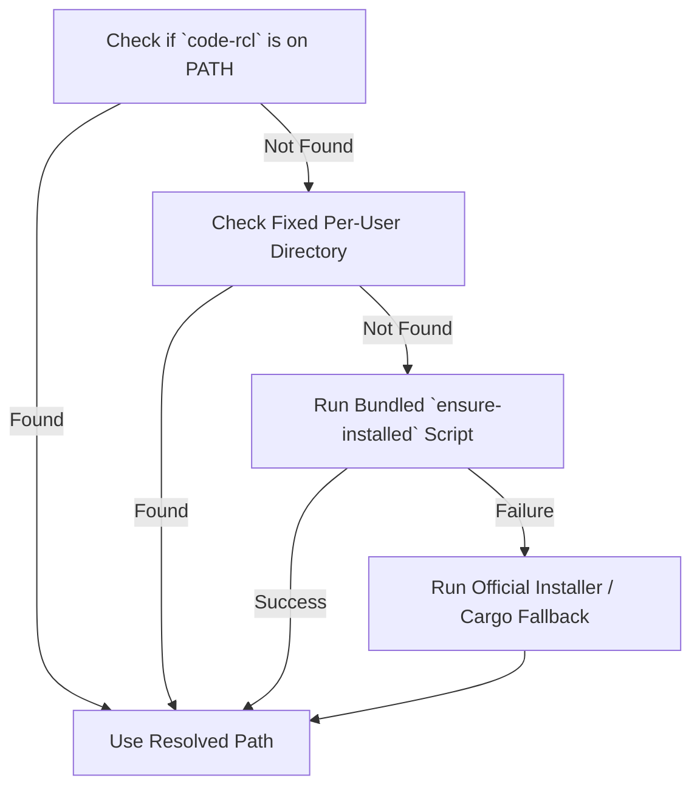

# `code-rcl` Codebase Recall & Architecture Intelligence Skill

`code-rcl` (`codebase-recall`) is a high-performance, standalone Rust CLI that parses codebases using Tree-sitter into a persistent, Blake3-indexed SQLite cache (`.code-rcl/cache.db`). It provides instant codebase intelligence, architecture digests, caller/impact tracking, and dependency-aware prompt context without requiring the AI agent to read every source file manually.

This skill treats `code-rcl` as both an **installed system tool** and a **Model Context Protocol (MCP) server** that runs against **any target repository** the agent is tasked to analyze or modify.

- **Multi-Language AST Parsing:** Powered by Tree-sitter for **Rust**, **Go**, **JavaScript/JSX**, **TypeScript/TSX**, **Python**, **Java**, **Kotlin**, and Single-File Components (**Vue**, **Svelte**).

---

## 0. Execution Modes: Native MCP Tools vs. CLI

`code-rcl` can be invoked in two ways by AI Agents:

### Mode A: Native MCP Tools (Recommended when MCP is configured)
When `code-rcl` is registered as an MCP server in your environment, use native tool calls directly without launching shell commands:

| MCP Tool Name | Purpose | Key Parameters |
| :--- | :--- | :--- |
| `code_rcl_digest` | High-level architectural outline, modules, and API index (saves 80–90% prompt tokens) | `project` (opt), `path` (opt), `all` (bool), `with_docs` (bool), `doc_lines` (int), `json` (bool) |
| `code_rcl_search` | Instant symbol, entity & string literal search with fuzzy & grep fallback (0–5ms) | `query` (required), `project`, `kind`, `exported_only`, `strings` (bool), `limit` |
| `code_rcl_impact` | Bidirectional caller & callee blast radius analysis before refactoring, with risk flags. Use `diff: true` to analyze your uncommitted changes without naming a symbol | `symbol` (required unless `diff`), `diff` (bool), `project`, `depth` (default 2), `direction` ("both" \| "reverse" \| "forward"), `kinds`, `precise` (bool), `json` |
| `code_rcl_path` | Shortest call/import chain from one symbol to another ("how does A reach B?") | `from` (required), `to` (required), `project`, `direction` ("forward" \| "reverse" \| "any"), `max_depth`, `kinds`, `json` |
| `code_rcl_report` | One-page architecture overview: core hubs, subsystems (communities) with key files and cohesion, bridge files, suggested next commands. Read first when orienting | `project`, `json` |
| `code_rcl_explain` | One-call summary of a symbol: signature, docs, members, direct callers/callees, risk flags | `symbol` (required), `project`, `json` |
| `code_rcl_dump` | Relation-aware neighborhood context bundle around a focal symbol/file | `target` (required), `project`, `depth` (1–5), `max_size_kb` |
| `code_rcl_sync` | Incremental AST sync with optional compiler-grade (`precise: true`) LSP pass | `project`, `precise` (bool), `languages` (array), `full` (bool) |
| `code_rcl_graph` | Code relation graph query in structured JSON (`version: 2`) | `project`, `scope` ("file" \| "symbol" \| "both"), `focus`, `depth`, `precise` (bool) |

> **⚠️ When to use `precise: true`:**
> - By default, all tools operate in **instant heuristic mode** (< 50ms), using Tree-sitter AST parsing and cached ground-truth references.
> - Use `precise: true` (in `code_rcl_sync` or `code_rcl_impact`) **ONLY** when refactoring complex Go interfaces, Rust traits, or polymorphic methods where 100% compiler verification is needed to resolve ambiguous dispatches.
> - Do **NOT** use `precise: true` for everyday code reading or simple edits, as starting Language Servers adds latency and CPU load.

#### Automated Setup Command:
Any agent can configure the MCP server and install this skill in 1 command:
```bash
# Auto-configure current workspace (Antigravity / Gemini .agents and Claude Code .mcp.json)
code-rcl setup --workspace

# Or configure globally for all projects (~/.gemini/config/mcp_config.json)
code-rcl setup --global
```

#### Manual Agent MCP Server Configuration (`mcp_config.json`):
```json
{
  "mcpServers": {
    "code-rcl": {
      "command": "code-rcl",
      "args": ["mcp"]
    }
  }
}
```

### Mode B: Direct CLI Execution (When Running Shell Commands)
If native MCP tools are not available in your tool declaration list, execute `code-rcl` via CLI commands following the resolution lifecycle in Section 1.

---

## 1. System Binary Resolution & Automated Lifecycle

Never look for or compile binaries in the target repository's `target/` directory. Instead, resolve or install the system binary using this strict lifecycle:

### Resolution Hierarchy



1. **System `PATH` Check:**
   - **Unix/macOS:** `command -v code-rcl`
   - **Windows:** `Get-Command code-rcl -ErrorAction SilentlyContinue` (PowerShell) or `where code-rcl` (CMD)
2. **Fixed Per-User Install Path:**
   If installed recently, the current shell session might not have reloaded its environment variables:
   - **Unix/macOS:** `~/.code-rcl/bin/code-rcl` (i.e. `$HOME/.code-rcl/bin/code-rcl`)
   - **Windows:** `$HOME\.code-rcl\bin\code-rcl.exe` or `$env:USERPROFILE\.code-rcl\bin\code-rcl.exe`
3. **Automated Self-Installation:**
   Use the bundled scripts or the binary's `setup` command:
   ```bash
   code-rcl setup --workspace
   ```
   *Manual installation fallback:*
   - **Unix/macOS:**
     ```bash
     curl --proto '=https' --tlsv1.2 -LsSf https://github.com/BknOrg/codebase-recall/releases/latest/download/codebase-recall-installer.sh | sh
     ```
   - **Windows (PowerShell):**
     ```powershell
     irm https://github.com/BknOrg/codebase-recall/releases/latest/download/codebase-recall-installer.ps1 | iex
     ```
   - **Cargo (if Rust toolchain is present):**
     ```bash
     cargo install codebase-recall
     ```
4. **Verification & Execution:**
   Always verify with `--version` and store the **absolute binary path** in a variable for subsequent commands. Do not assume bare `code-rcl` works in the running shell process if it was just installed.

---

## 2. Agent Decision Playbook & Workflow Recipes

Use this matrix to determine the optimal command for your analytical task:

| Agent Objective | Recommended Command / MCP Tool | Why This Command |
| :--- | :--- | :--- |
| **New Project Onboarding** | `code-rcl digest -o architecture.md` or `code_rcl_digest` | Strips function bodies, preserves public API signatures, and detects **Core Architecture Hubs** while saving 80–90% LLM tokens. |
| **Sub-Module Inspection** | `code-rcl digest <subpath> --project <root>` or `code_rcl_digest` | Restricts architectural digest to a specific subsystem without re-rooting the project cache. |
| **Locate Symbols or Literal Strings** | `code-rcl search <query>` or `code_rcl_search` | Instantly finds symbol declarations and call-site string literals (e.g. config keys, error strings) with fuzzy suggestions and hybrid grep fallback. |
| **Pre-Refactoring Blast Radius** | `code-rcl impact <symbol> --json` or `code_rcl_impact` | Bidirectional 2-hop analysis: shows upstream callers (*pemanggil*) and downstream callees (*yang dipanggil*) with source line snippets and confidence scores. |
| **Architecture Overview / Subsystems** | `code-rcl report` or read `.code-rcl/REPORT.md` (or `code_rcl_report`) | Subsystems detected from imports and calls, their key files and cohesion, the bridge files between them, and ready-to-run follow-up commands. `sync` keeps the file fresh. |
| **Check What Your Edits Affect** | `code-rcl impact --diff` or `code_rcl_impact` with `diff: true` | Finds symbols touched by uncommitted git changes and reports their blast radius, so you never have to name the symbols yourself. |
| **Understand One Symbol** | `code-rcl explain <symbol>` or `code_rcl_explain` | Signature, docs, members and direct callers/callees in one call, before you read or edit the file. |
| **How Does A Reach B?** | `code-rcl path <from> <to>` or `code_rcl_path` | Shortest chain of calls/imports with the source line of each hop. `found: false` is a valid answer; retry with `--direction any`. |
| **Focused LLM Prompt Context** | `code-rcl dump -r <symbol> --depth 2 -o context.md` or `code_rcl_dump` | Extracts *only* the connected dependency neighborhood of the target symbol into Markdown, eliminating hallucination noise. |
| **Small Repo Context Dump** | `code-rcl dump -o codebase-context.md` | Dumps the entire repository safely: respects `.gitignore`, skips binaries/media/lockfiles/secrets, and dynamically expands markdown fences. |
| **Machine-Readable Graph Export** | `code-rcl graph --format json -o graph.json` or `code_rcl_graph` | Exports the full AST relation graph into a standardized `version: 2` JSON schema for tool integration. |
| **Visual Architecture Review** | `code-rcl serve` | Launches a self-terminating interactive browser viewer with force-simulation, node spotlighting, and zero background resource leak. |
| **Compiler-Exact Resolution** | `code-rcl sync --precise` | Leverages real language servers (rust-analyzer, gopls, pyright, typescript, jdtls, kotlin) to eliminate ambiguous call sites. |

---

## 3. Detailed Command Reference

All commands automatically initialize `.code-rcl/cache.db` and incrementally sync modified source files on demand (unless `--no-sync` is specified).

### 3.1 `code-rcl digest` — Architectural Skeleton & Hub Detection

Generates an architecture outline and public API digest. Strips function and method bodies (`{ ... }`), keeping declarations, type signatures, and doc comments. Calculates graph degree centrality to detect **Core Architecture Hubs**.

```bash
# Digest entire project to stdout or file
code-rcl digest -o architecture.md

# Digest a specific directory inside the project
code-rcl digest src/commands --project . -o commands-digest.md

# Include first 3 lines of doc comments per symbol (strips heavy diagrams to save tokens)
code-rcl digest --with-docs

# Custom doc comment line limit (e.g. 5 lines)
code-rcl digest --doc-lines 5

# Include private and internal symbols
code-rcl digest --all

# Machine-readable JSON output for programmatic evaluation
code-rcl digest --json -o digest.json
```

#### Flags

| Flag | Default | Description |
| :--- | :--- | :--- |
| `[PATH]` | `.` | Target directory or sub-path to outline. |
| `--project <PATH>` | *auto-detect* | Explicit project root. When provided, `[PATH]` acts as an internal filter rather than creating an isolated cache. |
| `-o, --output <PATH>` | *stdout* | Output file path (Markdown or JSON). |
| `--with-docs` | `false` | Include the first 3 lines of doc comments (`///`) under each symbol. |
| `--doc-lines <N>` | `0` | Include up to N lines of doc comments (`0` disables doc comments; setting > 0 enables docs). |
| `--all` | `false` | Include private/internal functions, methods, and types (default: public only). |
| `--json` | `false` | Output structured JSON instead of Markdown. |
| `--no-sync` | `false` | Skip incremental file re-indexing before generating digest. |

> **Token Economy & Rich Documentation Signals:**
> When `--with-docs` or `--doc-lines` is enabled, fenced code blocks (e.g. ASCII diagrams ` ```text `) are automatically stripped from the preview to keep token usage minimal, but symbols containing rich diagrams are tagged with a `[diagram]` badge.

#### JSON Schema (`digest --json`)
The JSON structure provides:
- `project`: Project name string.
- `total_files`, `total_symbols`, `public_symbols`: Summary statistics.
- `languages`: Map of language names to scanned file counts.
- `hubs`: Array of top high-degree nodes (`label`, `kind`, `path`, `degree`).
- `modules`: Array of directory groups with `files[]`, each containing `types[]` (`name`, `kind`, `signature`, `doc`, `has_diagram`, `has_diagram_in_fields`, `methods[]`) and `functions[]` (`name`, `kind`, `signature`, `line`, `is_exported`, `doc`, `has_diagram`).

---

### 3.2 `code-rcl impact` — Blast Radius & Bidirectional Caller/Callee Analysis

Performs bidirectional dependency traversal along `calls` and `imports` edges. By default, traverses **2 hops up** (callers / *pemanggil*) and **2 hops down** (callees / *yang dipanggil*) to give an immediate 360° architectural context before refactoring.

```bash
# Bidirectional 2-hop analysis (default: callers + callees)
code-rcl impact execute_query

# Search deeper with 5 hops
code-rcl impact execute_query --depth 5

# Trace callers only (reverse upstream)
code-rcl impact execute_query --direction reverse

# Trace callees only (forward downstream)
code-rcl impact execute_query --direction forward

# Traverse only specific edge kinds
code-rcl impact UserSession --kinds calls
```

#### Flags

| Flag | Default | Description |
| :--- | :--- | :--- |
| `<TARGET>` | *required* | Target symbol name or file path to analyze. |
| `--project <PATH>` | `.` | Project root directory. |
| `--depth <N>` | `2` | Traversal hop depth (default: 2 hops up, 2 hops down). |
| `--direction <DIR>` | `both` | Traversal direction: `both` (callers & callees), `reverse` (callers only), `forward` (callees only). |
| `--kinds <LIST>` | `calls,imports` | Comma-separated edge kinds to traverse (`calls`, `imports`). |
| `--json` | `false` | Output results as structured JSON (always returns an array of reports). |
| `--no-sync` | `false` | Skip auto-syncing changed files before analyzing. |
| `--precise` | `false` | Use compiler-grade LSP edges (see Section 4). |

#### Output Features
- **Calling Source Line Snippet:** Shows the call-site source line under each item (`│ let res = ...`).
- **Edge Confidence:** Surfaces the edge confidence score (`(conf 0.95)`) based on the multi-tier resolution pipeline.
- **Risk Flags & Subsystem:** Each item can carry `⚠ public`, `⚠ low-conf`, and `⚠ cross-module (<subsystem>)`; the header shows the target's `Community` (subsystem) and a `Risk flags` count (see "Diff mode & risk flags" below).

#### JSON Schema (`impact --json`)
Always returns a JSON array (one report per matching definition). Caller and callee trees both nest their children under `callers`. Fields marked *optional* are omitted when unavailable.
```json
[
  {
    "target_symbol": "execute_query",
    "target_id": "sym:src/db.rs#execute_query@45",
    "target_kind": "function",
    "target_path": "src/db.rs",
    "direction": "both",
    "direct_callers_count": 2,
    "total_callers_count": 5,
    "direct_callees_count": 1,
    "total_callees_count": 3,
    "total_affected_count": 8,
    "total_affected_files": 3,
    "risky_affected_count": 2,
    "target_community": "src/db",
    "max_depth_reached": 2,
    "callers": [
      {
        "id": "sym:src/service.rs#fetch_user@12",
        "label": "fetch_user",
        "kind": "function",
        "path": "src/service.rs",
        "line": 18,
        "edge_kind": "calls",
        "confidence": 0.95,
        "snippet": "let res = execute_query(sql);",
        "depth": 1,
        "is_exported": true,
        "low_confidence": false,
        "crosses_module": true,
        "community": "src/service",
        "callers": []
      }
    ],
    "callees": [
      {
        "id": "sym:src/driver.rs#raw_exec@80",
        "label": "raw_exec",
        "kind": "function",
        "path": "src/driver.rs",
        "line": 85,
        "edge_kind": "calls",
        "confidence": 0.9,
        "depth": 1,
        "is_exported": false,
        "low_confidence": false,
        "crosses_module": false,
        "community": "src/db",
        "callers": []
      }
    ]
  }
]
```
`target_community`, `community` and `snippet` are *optional*.

---

#### Diff mode & risk flags

```bash
# Blast radius of everything you changed since HEAD (staged + unstaged)
code-rcl impact --diff
code-rcl impact --diff --json
```

`--diff` is mutually exclusive with `<SYMBOL>`. With no changes it prints "No uncommitted changes detected." (JSON: `[]`) and exits 0. Pure-deletion hunks and files outside the project are skipped. Every item and report also carries risk flags (in JSON: `is_exported`, `low_confidence`, `crosses_module`, and `risky_affected_count` per report), shown in the ASCII tree as `⚠ public`, `⚠ low-conf` (edge confidence ≤ 0.70, i.e. an ambiguous resolution that may hide dynamic dispatch) and `⚠ cross-module (<subsystem>)`. `crosses_module` means the item lives in a different **subsystem** (community, see `report`) than the target; when either side has no subsystem it falls back to "different top-level directory". Note it is *not* directory-based when subsystems exist, so a change can cross subsystems inside a single `src/` tree.

---

### 3.2a `code-rcl path` — How does A reach B?

```bash
code-rcl path main decorate                       # forward: main calls ... decorate
code-rcl path decorate main --direction reverse   # follow edges backwards
code-rcl path handle_request CacheDb --direction any --max-depth 10
```

Breadth-first search over `calls`/`imports` edges (`--kinds`), default `--max-depth 8`. Each hop shows the edge kind, confidence, and source line. No path is a normal result (`found: false`), not an error; an unknown symbol is an error. Returns one report per matching FROM/TO pair (max 5).

---

### 3.2b `code-rcl explain` — One symbol at a glance

```bash
code-rcl explain decorate
code-rcl explain CacheDb --json
```

Prints visibility, signature, doc comment, members (methods/fields) and the direct callers/callees with the same risk flags as `impact`.

---

### 3.2c `code-rcl report` — Architecture overview & subsystems

```bash
code-rcl report                 # print the report (Markdown)
code-rcl report --write         # write .code-rcl/REPORT.md
code-rcl report -o overview     # also/instead write a file (.md added; .json with --json)
code-rcl report --json
```

One page: summary, **core hubs** (most connected nodes), **subsystems**, **bridges**, and **suggested questions** (ready-to-run `impact`/`path`/`explain` commands built from the project's real hubs). `code-rcl sync` refreshes `.code-rcl/REPORT.md` automatically when files were added, changed or removed (or after `--precise`), never rewrites it when the content is identical, and only warns if the refresh fails; pass `sync --no-report` to skip it. The git post-commit hook from `setup --git-hook` runs `sync`, so the file stays current across commits. **Read the file before opening many source files.**

**Subsystems** (communities) are groups of files that depend on each other far more than on the rest. They are detected without an LLM, by Louvain modularity optimisation over file-level `imports`/`calls`/`references` links (a call between two symbols counts as a link between their files; symbols inherit their file's subsystem). Results are deterministic. Each subsystem is named after the one or two directories holding most of its files, and shows its **key files**, **cohesion** (share of its links that stay inside it) and the subsystems it is linked to. **Bridges** are files with links into other subsystems, ranked by how many they touch: the seams to be careful with.

Things to know:
- Files with no cross-file links, and one-file groups, belong to no subsystem (the report counts them).
- Subsystems come from the edges present when the graph is built. With the default `--kinds` (`calls,imports`) they are identical across `report`, `impact`, `explain`, `path` and `graph`; a `--kinds` that excludes both `imports` and `calls` yields none, and `impact` then falls back to directories for `crosses_module`.
- A repo whose code sits in one folder can still be split into several subsystems (that is the point), but very small or flat projects may yield few or none.

---

### 3.3 `code-rcl search` — High-Speed Symbol, String & Hybrid Search

Instantly finds symbols, types, and string literals across the codebase using the SQLite cache (0–5ms), eliminating manual grep overhead. Includes automatic fuzzy suggestions and hybrid fallback to full-text file search.

```bash
# Search for symbol declarations
code-rcl search QueryBuilder

# Search for string literals used in function calls & macros (e.g. CLI flags, error messages)
code-rcl search "user_id" --strings

# Filter by symbol kind
code-rcl search parse --kind function

# Machine-readable JSON output
code-rcl search AppConfig --json
```

#### Multi-Stage Search Intelligence
1. **Exact Symbol Match:** Instant lookup across indexed definitions, structs, enums, traits, functions, and methods.
2. **String Literal Indexing (`--strings`):** Indexes string literals appearing as arguments to function/method calls (e.g. `get_bool("flag")`, `get_string("key")`) and macros (`writeln!`, `user_error!`), pinpointing CLI flags, config keys, and message sites.
3. **Fuzzy Suggestions ("Did you mean: ...?"):** If zero exact matches are found, calculates Levenshtein distance against known symbols to suggest close matches.
4. **Hybrid Full-Text Grep Fallback:** When symbol and string searches return zero results, automatically performs a fast line-by-line file search across project source files, returning file and line locations without requiring a separate tool invocation.

#### Flags

| Flag | Default | Description |
| :--- | :--- | :--- |
| `<QUERY>` | *required* | Symbol name, identifier prefix, or string literal query. |
| `--project <PATH>` | `.` | Target project root directory. |
| `--strings` | `false` | Search indexed call-site string literals in addition to symbol definitions. |
| `--kind <KIND>` | *none* | Filter by symbol kind (`function`, `struct`, `enum`, `interface`, etc.). |
| `--exported-only` | `false` | Only return public/exported symbols. |
| `--limit <N>` | `25` | Maximum number of results to return. |
| `--json` | `false` | Output results as structured JSON. |
| `--no-sync` | `false` | Skip incremental file re-indexing before searching. |

---

### 3.4 `code-rcl dump` — LLM Context Bundler

Packs code into a clean, markdown-fenced context file. Features smart exclusions and dynamic fence widening (using ` ```` ` or more backticks if files contain triple backticks) to prevent format breakage in LLM chats.

```bash
# Full repository context dump
code-rcl dump . -o full-codebase.md

# Relation-aware targeted dump: extracts only the symbol and its dependency neighborhood
code-rcl dump -r build_graph --depth 2 -o feature-context.md

# Adjust per-file size limit (in KB)
code-rcl dump -r App --max-size-kb 100 -o app-context.md
```

#### Flags

| Flag | Default | Description |
| :--- | :--- | :--- |
| `[PATH]` | `.` | Target project directory or root path to dump. |
| `-o, --output <PATH>` | `codebase-context` | Output Markdown file stem or path (auto-appends `.md`). |
| `-r, --relation <NAME>` | *none* | Restrict dump to the target symbol/file and its connected dependency graph. |
| `--depth <N>` | `2` | Hop depth for relation neighborhood extraction. |
| `--max-size-kb <N>` | `50` | Skip files larger than this threshold. |
| `--no-sync` | `false` | Skip auto-syncing changed files before dumping. |

#### Exclusions Built-in
`dump` automatically skips:
- `.git`, `.cache`, `.code-rcl`, node_modules, target
- Binary & media assets (`.png`, `.jpg`, `.pdf`, `.zip`, `.wasm`, etc.)
- Lockfiles (`Cargo.lock`, `package-lock.json`, `pnpm-lock.yaml`, `bun.lockb`, etc.)
- Minified bundles (`.min.js`, `.chunk.js`)
- Sensitive environment files (`.env*`)

---

### 3.5 `code-rcl graph` — Dependency Graph Export

Generates static graph visualizations in zero-dependency HTML, Graphviz DOT, or structured JSON format.

```bash
# Generate standalone interactive HTML
code-rcl graph --format html -o build/graph.html

# Export standardized JSON and DOT simultaneously
code-rcl graph --format json,dot -o build/architecture

# File-level imports only with high confidence
code-rcl graph --scope file --min-confidence 0.7

# Focus on a specific symbol's neighborhood
code-rcl graph --focus handle_request --depth 2
```

#### Subsystems in the graph
The graph JSON (`version: 2`, additive) carries a top-level `communities` array (`id`, `label`, `size`) and a `community` id on file and symbol nodes (omitted when none). The HTML viewer has a **"color by subsystem"** toggle (default: color by kind) with a matching legend, and shows the subsystem in each node's tooltip.

---

### 3.6 `code-rcl serve` — Throwaway Interactive Browser Server

Hosts an interactive graph viewer with real-time D3 physics simulation on `127.0.0.1`.

```bash
# Launch interactive viewer (picks free port and opens default browser)
code-rcl serve

# Pin specific port without auto-opening browser
code-rcl serve --port 8080 --no-open
```

#### Zero Background Leak Guarantee
- Uses an active `EventSource` (`/live`) connection to the browser tab.
- **Auto-Reaper:** When the user closes the browser tab, the server automatically terminates within 2 seconds.

---

### 3.7 `code-rcl setup` — Self-Installation & MCP Registration

Automates AI Agent skill installation and MCP server registration.

```bash
# Install to current workspace (.agents/skills/code-rcl/SKILL.md & .mcp.json)
code-rcl setup --workspace

# Install globally to user profile config (~/.gemini/config and ~/.claude.json)
code-rcl setup --global

# Print the embedded SKILL.md directly to stdout without writing files
code-rcl setup --print-skill

# Configure only for Claude Code or Antigravity/Gemini
code-rcl setup --target claude
code-rcl setup --target gemini
```

#### Making agents actually use it (opt-in)

Registering the MCP server only makes the tools *available*; these flags make agents reach for them first. All are opt-in, idempotent, and only ever touch a marker-delimited block or their own hook entry — surrounding content is preserved, and malformed markers or invalid JSON abort without modifying the file.

```bash
# Add a <!-- code-rcl:begin --> ... <!-- code-rcl:end --> block to CLAUDE.md / AGENTS.md / GEMINI.md
# (--global: ~/.claude/CLAUDE.md and ~/.gemini/GEMINI.md)
code-rcl setup --workspace --instructions

# Re-sync the cache in the background after every commit (per repo; ignored with --global)
code-rcl setup --workspace --git-hook

# Claude Code SessionStart hook (.claude/settings.json) that reminds the agent to use code-rcl
code-rcl setup --workspace --claude-hook

# Undo exactly what the flags above added (all three when none is named); skips the normal install
code-rcl setup --workspace --remove
code-rcl setup --workspace --remove --git-hook
```

---

## 4. Multi-Tier Resolution Pipeline & `--precise` Mode

`code-rcl` resolves references across five tiers (L0 to L4):

1. **L0 — Compiler Backend (`--precise`):** Exact resolution via real language servers (`confidence = 1.0`). Drops false cross-file links to standard libraries.
2. **L1 — Lexical Scope:** Same-file AST scope definitions (`confidence = 0.95`). Quarantines local variables and closures from false cross-file matching.
3. **L2 — Explicit Imports & Namespaces:** Resolves module paths and explicit symbol imports (`confidence = 0.90`).
4. **L3 — Receiver Type Deduction:** Resolves calls on `self`, `this`, `Type::method`, and struct fields (`confidence = 0.80 - 0.90`).
5. **L4 — Scored Disambiguation:** Fallback scoring by import reachability (+3), export visibility (+2), arity match (+1 to +2), and directory proximity (+1). Emits an edge only if `margin >= 2`.

### Supported Language Servers for `--precise`

| Language | Language Server Binary | Recommended Install Command | Environment Override |
| :--- | :--- | :--- | :--- |
| **Rust** | `rust-analyzer` | `rustup component add rust-analyzer` | `CODE_RCL_LSP_RUST` |
| **Go** | `gopls` | `go install golang.org/x/tools/gopls@latest` | `CODE_RCL_LSP_GO` |
| **Python** | `pyright-langserver` | `npm install -g pyright` | `CODE_RCL_LSP_PYTHON` |
| **TypeScript** | `typescript-language-server`| `npm install -g typescript-language-server typescript` | `CODE_RCL_LSP_TYPESCRIPT` |
| **JavaScript** | `typescript-language-server`| `npm install -g typescript-language-server typescript` | `CODE_RCL_LSP_JAVASCRIPT` |
| **Java** | `jdtls` | Eclipse JDT.LS release (JDK 17+) | `CODE_RCL_LSP_JAVA` |
| **Kotlin** | `kotlin-language-server` | kotlin-language-server release | `CODE_RCL_LSP_KOTLIN` |

*Note:* If a language server is not installed, `code-rcl` logs a warning and gracefully falls back to AST heuristics for that language without failing the overall command.

---

## 5. Critical Gotchas & Troubleshooting

1. **Sub-Path Filtering vs Re-Rooting (`digest`):**
   - Running `code-rcl digest src/subpath` *without* `--project` re-roots the command, treating `src/subpath` as an isolated project with a separate cache.
   - To inspect a sub-path within the overall project graph, **always pass both**:
     ```bash
     code-rcl digest src/subpath --project .
     ```
2. **Ambiguous Symbols in `impact`:**
   - Multiple symbols across different files may share the same name (e.g. `run`, `new`, `parse`).
   - `impact <name> --json` always returns a **JSON array** where each element corresponds to a matching definition. Never assume the array length is 1.
3. **`--precise` State Persistence:**
   - LSP resolution results are stored directly in `.code-rcl/cache.db`.
   - Running a subsequent command without `--precise` will still read the compiler-grade edges unless file content changes. To force a complete re-evaluation, run `code-rcl sync --precise --precise-full` or delete `.code-rcl/`.
4. **Stale Session `PATH`:**
   - The official installer updates system environment variables, but existing terminal sessions do not reload them automatically. Always invoke the binary via its absolute path (`~/.code-rcl/bin/code-rcl` or `$HOME\.code-rcl\bin\code-rcl.exe`) or run `code-rcl setup`.
