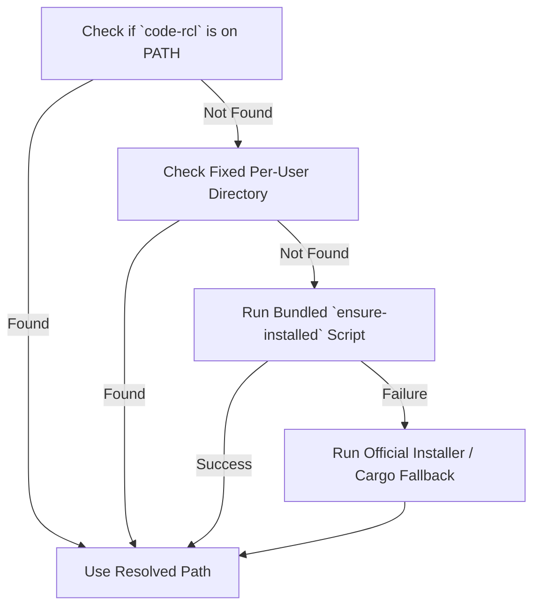

# `code-rcl` Codebase Recall & Architecture Intelligence Skill

`code-rcl` (`codebase-recall`) is a high-performance, standalone Rust CLI that parses codebases using Tree-sitter into a persistent, Blake3-indexed SQLite cache (`.code-rcl/cache.db`). It provides instant codebase intelligence, architecture digests, caller/impact tracking, and dependency-aware prompt context without requiring the AI agent to read every source file manually.

This skill treats `code-rcl` as both an **installed system tool** and a **Model Context Protocol (MCP) server** that runs against **any target repository** the agent is tasked to analyze or modify.

- **Multi-Language AST Parsing:** Powered by Tree-sitter for **Rust**, **Go**, **JavaScript/JSX**, **TypeScript/TSX**, **Python**, **Java**, **Kotlin**, and Single-File Components (**Vue**, **Svelte**).

---

## 0. Execution Modes: Native MCP Tools vs. CLI

`code-rcl` can be invoked in two ways by AI Agents:

### Mode A: Native MCP Tools (Recommended when MCP is configured)
When `code-rcl` is registered as an MCP server in your environment, use native tool calls directly without launching shell commands:

| MCP Tool Name | Purpose | Key Parameters |
| :--- | :--- | :--- |
| `code_rcl_digest` | High-level architectural outline, modules, and API index (saves 80–90% prompt tokens) | `project` (opt), `path` (opt), `all` (bool), `json` (bool) |
| `code_rcl_search` | Instant symbol & entity search across SQLite cache (0–5ms, no grep overhead) | `query` (required), `project`, `kind`, `exported_only`, `limit` |
| `code_rcl_impact` | Reverse caller/importer blast radius analysis before refactoring | `symbol` (required), `project`, `depth` (1–8), `kinds`, `precise` (bool), `json` |
| `code_rcl_dump` | Relation-aware neighborhood context bundle around a focal symbol/file | `target` (required), `project`, `depth` (1–5), `max_size_kb` |
| `code_rcl_sync` | Incremental AST sync with optional compiler-grade (`precise: true`) LSP pass | `project`, `precise` (bool), `languages` (array), `full` (bool) |
| `code_rcl_graph` | Code relation graph query in structured JSON (`version: 2`) | `project`, `scope` ("file" \| "symbol" \| "both"), `focus`, `depth`, `precise` (bool) |

> **⚠️ When to use `precise: true`:**
> - By default, all tools operate in **instant heuristic mode** (< 50ms), using Tree-sitter AST parsing and cached ground-truth references.
> - Use `precise: true` (in `code_rcl_sync` or `code_rcl_impact`) **ONLY** when refactoring complex Go interfaces, Rust traits, or polymorphic methods where 100% compiler verification is needed to resolve ambiguous dispatches.
> - Do **NOT** use `precise: true` for everyday code reading or simple edits, as starting Language Servers adds latency and CPU load.

#### Automated Setup Command:
Any agent can configure the MCP server and install this skill in 1 command:
```bash
# Auto-configure current workspace (Antigravity / Gemini .agents and Claude Code .mcp.json)
code-rcl setup --workspace

# Or configure globally for all projects (~/.gemini/config/mcp_config.json)
code-rcl setup --global
```

#### Manual Agent MCP Server Configuration (`mcp_config.json`):
```json
{
  "mcpServers": {
    "code-rcl": {
      "command": "code-rcl",
      "args": ["mcp"]
    }
  }
}
```

### Mode B: Direct CLI Execution (When Running Shell Commands)
If native MCP tools are not available in your tool declaration list, execute `code-rcl` via CLI commands following the resolution lifecycle in Section 1.

---

## 1. System Binary Resolution & Automated Lifecycle

Never look for or compile binaries in the target repository's `target/` directory. Instead, resolve or install the system binary using this strict lifecycle:

### Resolution Hierarchy



1. **System `PATH` Check:**
   - **Unix/macOS:** `command -v code-rcl`
   - **Windows:** `Get-Command code-rcl -ErrorAction SilentlyContinue` (PowerShell) or `where code-rcl` (CMD)
2. **Fixed Per-User Install Path:**
   If installed recently, the current shell session might not have reloaded its environment variables:
   - **Unix/macOS:** `~/.code-rcl/bin/code-rcl` (i.e. `$HOME/.code-rcl/bin/code-rcl`)
   - **Windows:** `$HOME\.code-rcl\bin\code-rcl.exe` or `$env:USERPROFILE\.code-rcl\bin\code-rcl.exe`
3. **Automated Self-Installation:**
   Use the bundled scripts or the binary's `setup` command:
   ```bash
   code-rcl setup --workspace
   ```
   *Manual installation fallback:*
   - **Unix/macOS:**
     ```bash
     curl --proto '=https' --tlsv1.2 -LsSf https://github.com/BknOrg/codebase-recall/releases/latest/download/codebase-recall-installer.sh | sh
     ```
   - **Windows (PowerShell):**
     ```powershell
     irm https://github.com/BknOrg/codebase-recall/releases/latest/download/codebase-recall-installer.ps1 | iex
     ```
   - **Cargo (if Rust toolchain is present):**
     ```bash
     cargo install codebase-recall
     ```
4. **Verification & Execution:**
   Always verify with `--version` and store the **absolute binary path** in a variable for subsequent commands. Do not assume bare `code-rcl` works in the running shell process if it was just installed.

---

## 2. Agent Decision Playbook & Workflow Recipes

Use this matrix to determine the optimal command for your analytical task:

| Agent Objective | Recommended Command / MCP Tool | Why This Command |
| :--- | :--- | :--- |
| **New Project Onboarding** | `code-rcl digest -o architecture.md` or `code_rcl_digest` | Strips function bodies, preserves public API signatures, and detects **Core Architecture Hubs** while saving 80–90% LLM tokens. |
| **Sub-Module Inspection** | `code-rcl digest <subpath> --project <root>` or `code_rcl_digest` | Restricts architectural digest to a specific subsystem without re-rooting the project cache. |
| **Pre-Refactoring Blast Radius** | `code-rcl impact <symbol> --json` or `code_rcl_impact` | Reverse-traverses `calls` and `imports` edges to identify all downstream and upstream callers affected by modifying a function or class. |
| **Focused LLM Prompt Context** | `code-rcl dump -r <symbol> --depth 2 -o context.md` or `code_rcl_dump` | Extracts *only* the connected dependency neighborhood of the target symbol into Markdown, eliminating hallucination noise. |
| **Small Repo Context Dump** | `code-rcl dump -o codebase-context.md` | Dumps the entire repository safely: respects `.gitignore`, skips binaries/media/lockfiles/secrets, and dynamically expands markdown fences. |
| **Machine-Readable Graph Export** | `code-rcl graph --format json -o graph.json` or `code_rcl_graph` | Exports the full AST relation graph into a standardized `version: 2` JSON schema for tool integration. |
| **Visual Architecture Review** | `code-rcl serve` | Launches a self-terminating interactive browser viewer with force-simulation, node spotlighting, and zero background resource leak. |
| **Compiler-Exact Resolution** | `code-rcl sync --precise` | Leverages real language servers (rust-analyzer, gopls, pyright, typescript, jdtls, kotlin) to eliminate ambiguous call sites. |

---

## 3. Detailed Command Reference

All commands automatically initialize `.code-rcl/cache.db` and incrementally sync modified source files on demand (unless `--no-sync` is specified).

### 3.1 `code-rcl digest` — Architectural Skeleton & Hub Detection

Generates an architecture outline and public API digest. Strips function and method bodies (`{ ... }`), keeping declarations, type signatures, and doc comments. Calculates graph degree centrality to detect **Core Architecture Hubs**.

```bash
# Digest entire project to stdout or file
code-rcl digest -o architecture.md

# Digest a specific directory inside the project
code-rcl digest src/commands --project . -o commands-digest.md

# Include private and internal symbols
code-rcl digest --all

# Machine-readable JSON output for programmatic evaluation
code-rcl digest --json -o digest.json
```

#### Flags

| Flag | Default | Description |
| :--- | :--- | :--- |
| `[PATH]` | `.` | Target directory or sub-path to outline. |
| `--project <PATH>` | *auto-detect* | Explicit project root. When provided, `[PATH]` acts as an internal filter rather than creating an isolated cache. |
| `-o, --output <PATH>` | *stdout* | Output file path (Markdown or JSON). |
| `--all` | `false` | Include private/internal functions, methods, and types (default: public only). |
| `--json` | `false` | Output structured JSON instead of Markdown. |
| `--no-sync` | `false` | Skip incremental file re-indexing before generating digest. |

#### JSON Schema (`digest --json`)
The JSON structure provides:
- `project`: Project name string.
- `total_files`, `total_symbols`, `public_symbols`: Summary statistics.
- `languages`: Map of language names to scanned file counts.
- `hubs`: Array of top high-degree nodes (`label`, `kind`, `path`, `degree`).
- `modules`: Array of directory groups with `files[]`, each containing `types[]` (with `methods[]`) and `functions[]` (`name`, `kind`, `signature`, `line`, `is_exported`).

---

### 3.2 `code-rcl impact` — Blast Radius & Caller Impact Analysis

Performs reverse dependency traversal along `calls` and `imports` edges to identify everything that will break or require updates if `<symbol>` is modified.

```bash
# Quick terminal ASCII tree check
code-rcl impact execute_query

# Search deeper with 5 hops
code-rcl impact execute_query --depth 5

# Traverse only specific edge kinds
code-rcl impact UserSession --kinds calls
```

#### Flags

| Flag | Default | Description |
| :--- | :--- | :--- |
| `<TARGET>` | *required* | Target symbol name or file path to analyze. |
| `--project <PATH>` | `.` | Project root directory. |
| `--depth <N>` | `5` | Maximum upstream caller traversal depth. |
| `--kinds <LIST>` | `calls,imports` | Comma-separated edge kinds to traverse backward (`calls`, `imports`). |
| `--json` | `false` | Output results as structured JSON (always returns an array of reports). |
| `--no-sync` | `false` | Skip auto-syncing changed files before analyzing. |
| `--precise` | `false` | Use compiler-grade LSP edges (see Section 4). |

#### JSON Schema (`impact --json`)
Always returns a JSON array:
```json
[
  {
    "target_symbol": "execute_query",
    "target_id": "sym:src/db.rs#execute_query@45",
    "target_kind": "function",
    "target_path": "src/db.rs",
    "direct_callers_count": 2,
    "total_affected_count": 8,
    "total_affected_files": 3,
    "max_depth_reached": 3,
    "callers": [
      {
        "id": "sym:src/service.rs#fetch_user@12",
        "label": "fetch_user",
        "kind": "function",
        "path": "src/service.rs",
        "line": 18,
        "edge_kind": "calls",
        "depth": 1,
        "callers": []
      }
    ]
  }
]
```

---

### 3.3 `code-rcl dump` — LLM Context Bundler

Packs code into a clean, markdown-fenced context file. Features smart exclusions and dynamic fence widening (using ` ```` ` or more backticks if files contain triple backticks) to prevent format breakage in LLM chats.

```bash
# Full repository context dump
code-rcl dump . -o full-codebase.md

# Relation-aware targeted dump: extracts only the symbol and its dependency neighborhood
code-rcl dump -r build_graph --depth 2 -o feature-context.md

# Adjust per-file size limit (in KB)
code-rcl dump -r App --max-size-kb 100 -o app-context.md
```

#### Flags

| Flag | Default | Description |
| :--- | :--- | :--- |
| `[PATH]` | `.` | Target project directory or root path to dump. |
| `-o, --output <PATH>` | `codebase-context` | Output Markdown file stem or path (auto-appends `.md`). |
| `-r, --relation <NAME>` | *none* | Restrict dump to the target symbol/file and its connected dependency graph. |
| `--depth <N>` | `2` | Hop depth for relation neighborhood extraction. |
| `--max-size-kb <N>` | `50` | Skip files larger than this threshold. |
| `--no-sync` | `false` | Skip auto-syncing changed files before dumping. |

#### Exclusions Built-in
`dump` automatically skips:
- `.git`, `.cache`, `.code-rcl`, node_modules, target
- Binary & media assets (`.png`, `.jpg`, `.pdf`, `.zip`, `.wasm`, etc.)
- Lockfiles (`Cargo.lock`, `package-lock.json`, `pnpm-lock.yaml`, `bun.lockb`, etc.)
- Minified bundles (`.min.js`, `.chunk.js`)
- Sensitive environment files (`.env*`)

---

### 3.4 `code-rcl graph` — Dependency Graph Export

Generates static graph visualizations in zero-dependency HTML, Graphviz DOT, or structured JSON format.

```bash
# Generate standalone interactive HTML
code-rcl graph --format html -o build/graph.html

# Export standardized JSON and DOT simultaneously
code-rcl graph --format json,dot -o build/architecture

# File-level imports only with high confidence
code-rcl graph --scope file --min-confidence 0.7

# Focus on a specific symbol's neighborhood
code-rcl graph --focus handle_request --depth 2
```

---

### 3.5 `code-rcl serve` — Throwaway Interactive Browser Server

Hosts an interactive graph viewer with real-time D3 physics simulation on `127.0.0.1`.

```bash
# Launch interactive viewer (picks free port and opens default browser)
code-rcl serve

# Pin specific port without auto-opening browser
code-rcl serve --port 8080 --no-open
```

#### Zero Background Leak Guarantee
- Uses an active `EventSource` (`/live`) connection to the browser tab.
- **Auto-Reaper:** When the user closes the browser tab, the server automatically terminates within 2 seconds.

---

### 3.6 `code-rcl setup` — Self-Installation & MCP Registration

Automates AI Agent skill installation and MCP server registration.

```bash
# Install to current workspace (.agents/skills/code-rcl/SKILL.md & .mcp.json)
code-rcl setup --workspace

# Install globally to user profile config (~/.gemini/config and ~/.claude.json)
code-rcl setup --global

# Print the embedded SKILL.md directly to stdout without writing files
code-rcl setup --print-skill

# Configure only for Claude Code or Antigravity/Gemini
code-rcl setup --target claude
code-rcl setup --target gemini
```

---

## 4. Multi-Tier Resolution Pipeline & `--precise` Mode

`code-rcl` resolves references across five tiers (L0 to L4):

1. **L0 — Compiler Backend (`--precise`):** Exact resolution via real language servers (`confidence = 1.0`). Drops false cross-file links to standard libraries.
2. **L1 — Lexical Scope:** Same-file AST scope definitions (`confidence = 0.95`). Quarantines local variables and closures from false cross-file matching.
3. **L2 — Explicit Imports & Namespaces:** Resolves module paths and explicit symbol imports (`confidence = 0.90`).
4. **L3 — Receiver Type Deduction:** Resolves calls on `self`, `this`, `Type::method`, and struct fields (`confidence = 0.80 - 0.90`).
5. **L4 — Scored Disambiguation:** Fallback scoring by import reachability (+3), export visibility (+2), arity match (+1 to +2), and directory proximity (+1). Emits an edge only if `margin >= 2`.

### Supported Language Servers for `--precise`

| Language | Language Server Binary | Recommended Install Command | Environment Override |
| :--- | :--- | :--- | :--- |
| **Rust** | `rust-analyzer` | `rustup component add rust-analyzer` | `CODE_RCL_LSP_RUST` |
| **Go** | `gopls` | `go install golang.org/x/tools/gopls@latest` | `CODE_RCL_LSP_GO` |
| **Python** | `pyright-langserver` | `npm install -g pyright` | `CODE_RCL_LSP_PYTHON` |
| **TypeScript** | `typescript-language-server`| `npm install -g typescript-language-server typescript` | `CODE_RCL_LSP_TYPESCRIPT` |
| **JavaScript** | `typescript-language-server`| `npm install -g typescript-language-server typescript` | `CODE_RCL_LSP_JAVASCRIPT` |
| **Java** | `jdtls` | Eclipse JDT.LS release (JDK 17+) | `CODE_RCL_LSP_JAVA` |
| **Kotlin** | `kotlin-language-server` | kotlin-language-server release | `CODE_RCL_LSP_KOTLIN` |

*Note:* If a language server is not installed, `code-rcl` logs a warning and gracefully falls back to AST heuristics for that language without failing the overall command.

---

## 5. Critical Gotchas & Troubleshooting

1. **Sub-Path Filtering vs Re-Rooting (`digest`):**
   - Running `code-rcl digest src/subpath` *without* `--project` re-roots the command, treating `src/subpath` as an isolated project with a separate cache.
   - To inspect a sub-path within the overall project graph, **always pass both**:
     ```bash
     code-rcl digest src/subpath --project .
     ```
2. **Ambiguous Symbols in `impact`:**
   - Multiple symbols across different files may share the same name (e.g. `run`, `new`, `parse`).
   - `impact <name> --json` always returns a **JSON array** where each element corresponds to a matching definition. Never assume the array length is 1.
3. **`--precise` State Persistence:**
   - LSP resolution results are stored directly in `.code-rcl/cache.db`.
   - Running a subsequent command without `--precise` will still read the compiler-grade edges unless file content changes. To force a complete re-evaluation, run `code-rcl sync --precise --precise-full` or delete `.code-rcl/`.
4. **Stale Session `PATH`:**
   - The official installer updates system environment variables, but existing terminal sessions do not reload them automatically. Always invoke the binary via its absolute path (`~/.code-rcl/bin/code-rcl` or `$HOME\.code-rcl\bin\code-rcl.exe`) or run `code-rcl setup`.
